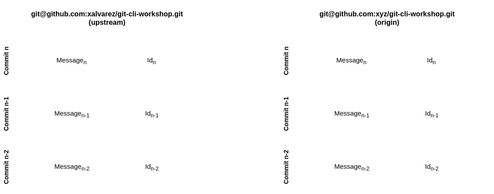

# Git CLI Workshop

Xavier Alvarez

20/05/2019

---

## Agenda

@ol

- Happy Path
- Re-writing and viewing history
- Conflict resolution
- Reverts & resets
- Removing & moving files
- Git configuration
- Handling multiple accounts
- Guidelines for writing commits

@olend

---

## Happy Path

---

### Git Repositories

---

### Git Repositories

---

## Interesting Resources

@ul

- Git Official Docs: [git-scm.com/doc](https://git-scm.com/doc)
- [try.github.io](http://try.github.io)
- Hub: [github.com/github/hub](https://github.com/github/hub)

@ulend